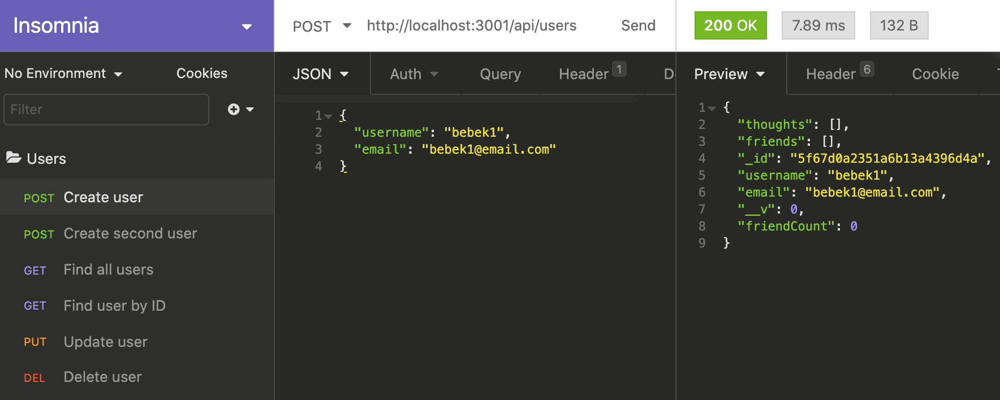
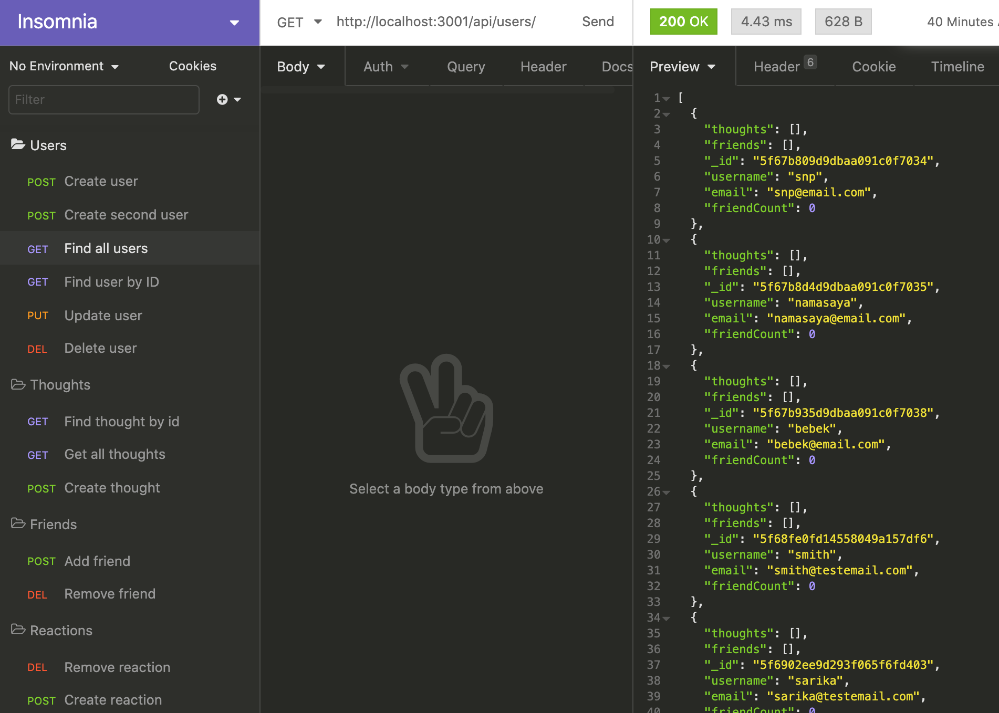
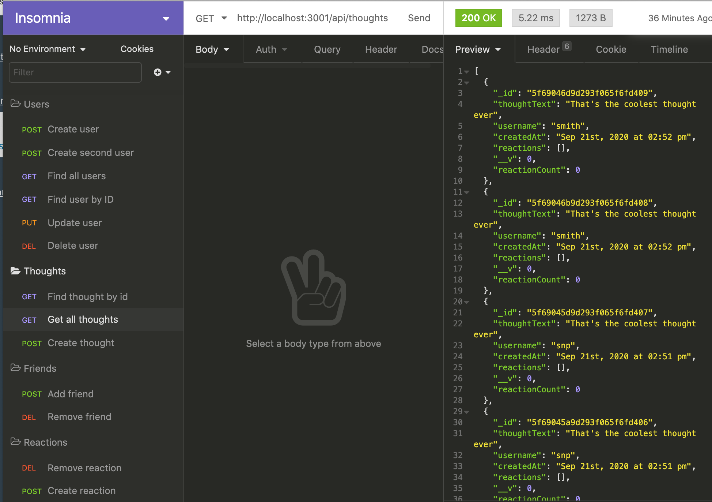
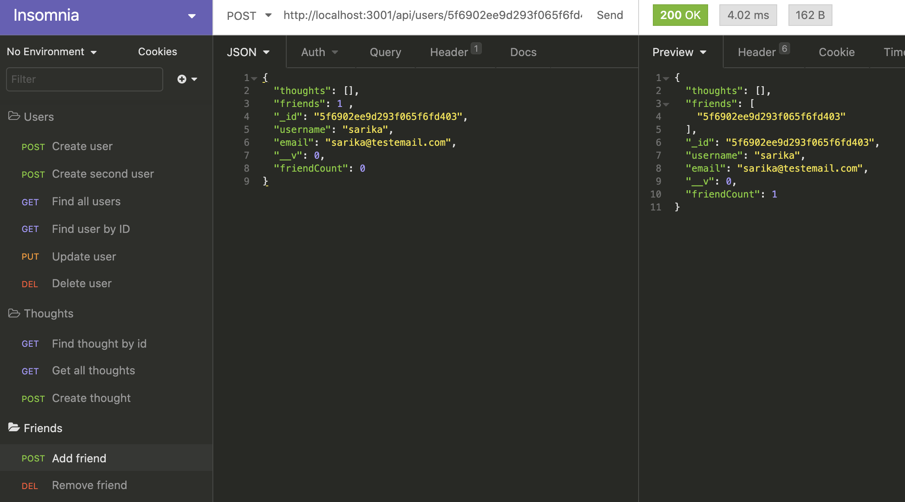

# social-netwrok-API

An API for a social network web application, where users can share their thoughts, react to friends' thoughts and create a friend list.

### Github : https://github.com/sylviaprabudy/social-network-api

### Walkthrough video 
#### Users CRUD : https://drive.google.com/file/d/10cJNOXYaakMiEfkjXL7Q1z2j_gIqKSgv/view
#### Create, Get, Find Thoughts : https://drive.google.com/file/d/1S66QvkJM01llmO7Q2joorHUH5jRr8TSH/view
#### Add, Remove Friend : https://drive.google.com/file/d/18_lWBu-7mll4xsf8YiDvdR30Rg-zjKEr/view

## Description
An API for a social network web application, where users can share their thoughts, react to friends' thoughts and create a friend list.


## User Story
```
- AS A social media startup
- I WANT an API for my social network that uses a NoSQL database
- SO THAT my website can handle large amounts of unstructured data
```


## Usage
- Application allows to add accounts with usernames and emails.
- I am able to create, read, update and delete(CRUD) users.
- This application allows me to add friends and show many friends I have.
- This application allows me to create and find reactions and thoughts.
- I am able to delete reactions, thoughts and remove friends.


## Screenshots






## Technologies Use
<p><a href="https://www.mongodb.com/">MongoDB</a></p>
<p><a href="https://www.npmjs.com/package/mongoose">Mongoose</a></p>
<p><a href="https://nodejs.org/">Node.js</a></p>
<p><a href="https://www.npmjs.com/package/express">Express.js</a></p>
<p><a href="https://www.npmjs.com/package/moment">Moment.js</a></p>


## Contributor:
Sylvia Prabudy ©2020 All Rights Reserved.
- - -